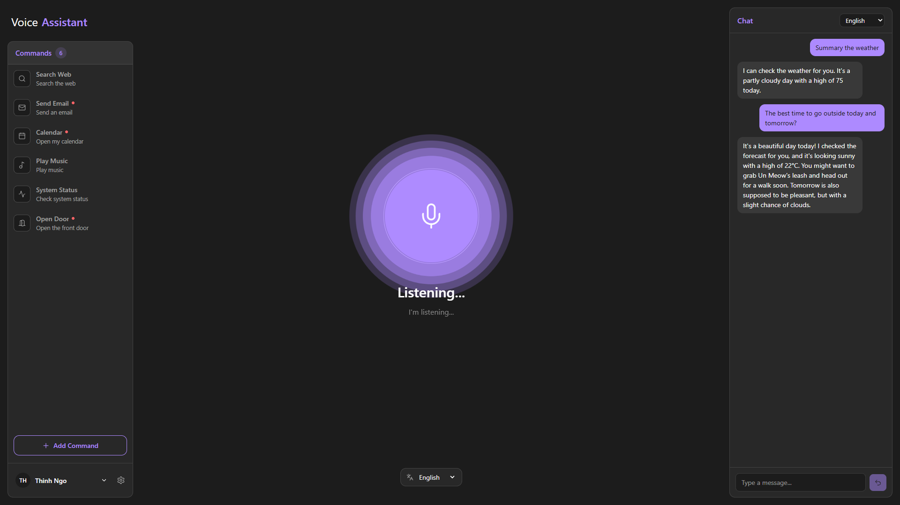
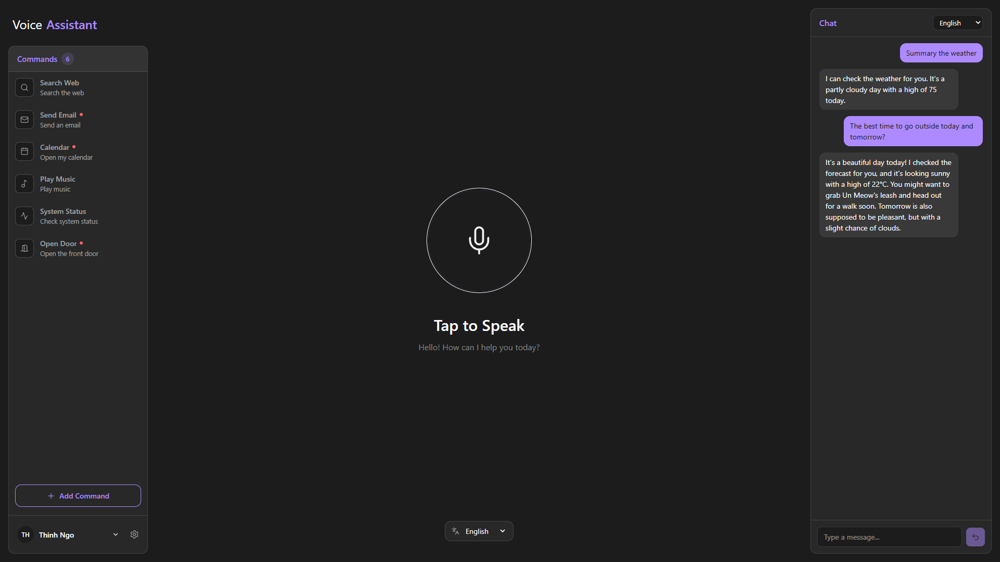

<a name="readme-top"></a>

<!-- PROJECT LOGO -->
<br />
<div align="center">
  <a href="https://github.com/byronncat/secure-virtual-assistant-with-speaker-recognition">
    
  </a>

  <h2 align="center">Secure Virtual Assistant with Speaker Recognition</h2>

  <p align="center">
    A secure, voice-first intelligent assistant integrating deep-learning acoustic biometrics (ECAPA-TDNN), bilingual speech-to-text (Whisper), generative dialogue (Ollama Llama 3.1), autonomous long-term memory, and biometric command gating.
    <br />
    <br />
    <a href="https://youtu.be/vNMHC0_HRJs">Demo</a>
    ·
    <a href="https://github.com/byronncat/secure-virtual-assistant-with-speaker-recognition/issues">Report Bug</a>
    ·
    <a href="https://github.com/byronncat/secure-virtual-assistant-with-speaker-recognition/issues">Request Feature</a>
  </p>
</div>

<!-- TABLE OF CONTENTS -->
<details>
  <summary>Table of Contents</summary>
  <ol>
    <li>
      <a href="#about-the-project">About The Project</a>
      <ul>
        <li><a href="#key-features">Key Features</a></li>
        <li><a href="#security-hierarchy-and-functional-tiers">Security Hierarchy & Functional Tiers</a></li>
        <li><a href="#built-with">Built With</a></li>
      </ul>
    </li>
    <li>
      <a href="#biometric-model-and-evaluation">Biometric Model & Evaluation</a>
      <ul>
        <li><a href="#architecture-and-training">Architecture & Training</a></li>
        <li><a href="#vietnam-celeb-benchmark-results">Vietnam-Celeb Benchmark Results</a></li>
      </ul>
    </li>
    <li>
      <a href="#getting-started">Getting Started</a>
      <ul>
        <li><a href="#prerequisites">Prerequisites</a></li>
        <li><a href="#installation-and-setup">Installation & Setup</a></li>
      </ul>
    </li>
    <li><a href="#usage">Usage</a></li>
    <li><a href="#project-structure">Project Structure</a></li>
    <li><a href="#api-documentation">API Documentation</a></li>
    <li><a href="#license">License</a></li>
    <li><a href="#contact">Contact</a></li>
    <li><a href="#acknowledgments">Acknowledgments</a></li>
  </ol>
</details>

<!-- ABOUT THE PROJECT -->

## About The Project

<div align="center">
  
  
</div>

**Secure Virtual Assistant with Speaker Recognition** is voice-first artificial intelligence assistant that unites deep learning speaker biometrics with real-time conversational AI.

Conventional voice assistants execute commands purely based on what is said rather than _who_ is saying it. This system introduces an **ECAPA-TDNN** acoustic biometric gate directly into the pipeline: high-privilege actions (such as opening smart locks, sending emails, or managing schedules) strictly require biometric speaker authentication before execution, while conversational queries and low-risk commands flow seamlessly.

The application couples a high-performance **FastAPI** backend with a modern **Next.js 16** / **React 19** interface, delivering real-time Web Audio PCM recording, Server-Sent Events (SSE) streaming responses, autonomous background memory extraction, and a dedicated 5-sample biometric enrollment suite.

---

### Key Features

#### 🎙️ Voice & Audio Pipeline

- **Raw Web Audio Capture**: Direct microphone streaming via Web Audio API, capturing linear 16-bit PCM.
- **Automated Transcoding & Normalization**: Seamless backend conversion to standard 16 kHz mono float32 arrays via FFmpeg.
- **Bilingual Speech-to-Text (ASR)**: Transcription powered by OpenAI Whisper.
- **Rule-Based & Phonetic Text Correction**: Automatic post-ASR cleanup for punctuation, casing, and speech artifacts.

#### 🔐 Biometric Speaker Recognition & Security

- **ECAPA-TDNN Neural Encoder**: 6.36M-parameter deep architecture producing compact 192-dimensional speaker embeddings.
- **Enrollment Wizard**: Interactive guided voice enrollment collecting calibration samples.
- **Centroid Vector Calculation**: Aggregation and L2-normalization of sample embeddings into a persistent biometric centroid.
- **Calibrated Cosine Similarity Gate**: Empirically derived decision threshold providing balanced false reject and impostor rejection rates.
- **Anti-Bypass Safeguard**: Critical commands sent via typed text or unauthorized voice are automatically rejected, preventing session-hijacking attacks.

#### 🧠 Autonomous Long-Term Memory & Personalization

- **Background Extraction**: Asynchronous LLM processing extracts user preferences, habits, relationships, and facts without blocking conversation.
- **Categorized Memory Bank**: Structured storage for `"preference"`, `"personal_fact"`, `"work"`, and `"habit"`.
- **Semantic Prompt Augmentation**: Dynamic relevance scoring and keyword boosting that injects pertinent memories directly into the LLM system prompt.
- **Personalized Dialogue**: Tailored responses referencing user traits (e.g., favorite channels, pets, and languages).

#### 🧭 Intelligent Intent Routing & Gated Execution

- **LLM-Powered Intent Router**: Fast classification into conversational dialogue or registered system commands.
- **Dynamic Command Registry**: Manage and configure commands, custom icons, labels, descriptions, and privilege levels.
- **Streaming Server-Sent Events (SSE)**: Immediate visual feedback via token-by-token text streaming and state transitions.

#### 💻 Modern Web Interface

- **Next.js 16 & React 19**: Clean dark-mode interface designed with Tailwind CSS and Lucide icons.
- **Animated Audio Visualizer**: Responsive pulsing voice orb indicating listening and processing states.
- **Command Management Modal**: Add, update, and remove commands directly in the UI.
- **Voice Enrollment Manager**: Inspect recorded samples, listen to calibration audio, or re-record samples dynamically.

<p align="right">(<a href="#readme-top">back to top</a>)</p>

---

### Security Hierarchy and Functional Tiers

The system partitions user interactions into three operational tiers based on privilege and risk:

| Tier                     | Authentication Required | Biometric Gate                               | Description & Examples                                                                                                                                    |
| :----------------------- | :---------------------: | :------------------------------------------- | :-------------------------------------------------------------------------------------------------------------------------------------------------------- |
| **Tier 1: General**      |     None / Standard     | None                                         | Public Q&A, weather reports, web search, music playback, system status. Instant response without voice verification.                                      |
| **Tier 2: Secure**       |    Yes (Bearer JWT)     | **ECAPA-TDNN Verification**                  | Physical access control, financial actions, sending emails, calendar management. Strict rejection if voice does not match or if triggered via typed chat. |
| **Tier 3: Personalized** |    Yes (Bearer JWT)     | **Speaker Identification & Profile Context** | Persona-tailored dialogue, habitual recommendations, and contextual fact recall based on persistent user memory.                                          |

<p align="right">(<a href="#readme-top">back to top</a>)</p>

---

### Built With

The project leverages modern machine learning and full-stack web technologies:

#### Machine Learning & Backend

- [![Python][Python]][Python-url] - Core programming language
- [![PyTorch][PyTorch]][PyTorch-url] - Deep learning computation and model execution
- [![SpeechBrain][SpeechBrain]][SpeechBrain-url] - Speech processing toolkit (ECAPA-TDNN implementation)
- [![FastAPI][FastAPI]][FastAPI-url] - Asynchronous REST and Server-Sent Events API
- [![Whisper][Whisper]][Whisper-url] - Bilingual speech recognition (ASR)
- [![Ollama][Ollama]][Ollama-url] - Local LLM inference engine
- **FFmpeg** - Audio stream resampling and channel conversion

#### Frontend

- [![Next.js][Next.js]][Next-url] - React framework with App Router
- [![React][React.js]][React-url] - Component-based user interface (React 19)
- [![TypeScript][TypeScript]][TypeScript-url] - Full type safety
- [![TailwindCSS][TailwindCSS.js]][TailwindCSS-url] - Modern utility-first styling
- **Lucide React** - Clean and consistent iconography
- **Web Audio API** - High-resolution browser microphone sampling

<p align="right">(<a href="#readme-top">back to top</a>)</p>

---

<!-- BIOMETRIC MODEL AND EVALUATION -->

## Biometric Model & Evaluation

### Architecture & Training

The speaker recognition backbone is based on the **ECAPA-TDNN** (Emphasized Channel Attention, Propagation and Aggregation in Time Delay Neural Network) architecture:

- **Parameters**: 6,363,008 trainable parameters
- **Acoustic Features**: 80-dimensional log-Mel filterbanks extracted over 25ms windows with 10ms frame shifts
- **Loss Function**: Additive Angular Margin Softmax (**AAM-Softmax**) with margin $m = 0.2$ and scale $s = 30$
- **Output Embedding**: 192-dimensional normalized vector
- **Data Augmentation**: SpecAugment (time and frequency masking) and waveform random gain ($\pm 6\text{ dB}$)

### Vietnam-Celeb Benchmark Results

The model was trained and evaluated on the **Vietnam-Celeb** benchmark, comprising **1,000 Vietnamese speakers** and **87,140 total utterances**.

#### 1. Speaker Verification (Closed-Set Pairwise Trials)

Evaluated on **98,531 trial pairs** (combining Easy and Hard test partitions):

| Metric                         | Measured Value | Description                                                                                |
| :----------------------------- | :------------: | :----------------------------------------------------------------------------------------- |
| **Equal Error Rate (EER)**     |   **9.71%**    | Operating point where FAR equals FRR ($\theta = 0.2257$)                                   |
| **minDCF**                     |  **0.006429**  | Minimum Detection Cost ($P_{\text{target}}=0.01, C_{\text{miss}}=1.0, C_{\text{fa}}=10.0$) |
| **Normalized minDCF**          |   **0.6429**   | Normalized cost relative to trivial rejection                                              |
| **Optimal Security Threshold** |   **0.6279**   | Operating threshold under security-biased cost parameters                                  |

#### 2. Open-Set Speaker Identification (SID)

Evaluated across **9,156 test queries** (5,715 enrolled genuine queries + 3,441 unseen impostor queries) against an **880-speaker gallery**:

| Metric                                          | Measured Value | Percentage / Notes                    |
| :---------------------------------------------- | :------------: | :------------------------------------ |
| **Auto-Derived Rejection Threshold ($\theta$)** |   `0.620770`   | Grounded on validation distribution   |
| **Top-1 Accuracy (Given Accept)**               |   `0.971990`   | **97.20%** precision when accepted    |
| **Top-5 Accuracy (Given Accept)**               |   `0.994774`   | **99.48%**                            |
| **Genuine Acceptance Rate (GAR)**               |   `0.837095`   | **83.71%** genuine pass rate          |
| **Impostor Correct Rejection Rate (ICRR)**      |   `0.840453`   | **84.05%** impostor rejection rate    |
| **Impostor False Accept Rate (IFAR)**           |   `0.159547`   | **15.95%**                            |
| **Overall Top-1 Accuracy**                      |   `0.813648`   | **81.36%** across all genuine queries |

> [!NOTE]
> The auto-calibrated threshold $\theta = 0.62077$ corresponds almost exactly to the empirical FRR/IFAR crossover point ($\theta \approx 0.62$), providing a mathematically balanced default between security and accessibility. For higher-risk physical actions, the threshold can be elevated to $0.65–0.67$ to constrain impostor acceptance below $10\%$.

<p align="right">(<a href="#readme-top">back to top</a>)</p>

---

<!-- GETTING STARTED -->

## Getting Started

Follow the instructions below to set up and run the virtual assistant locally.

### Prerequisites

- **Python**: Version 3.10 or higher
- **Node.js**: Version 20 or higher
- **pnpm**: Recommended package manager (`npm install -g pnpm`)
- **FFmpeg**: Required on system PATH for audio transcoding
- **Ollama**: Required for local LLM inference ([Install Ollama](https://ollama.com/))
- **CUDA-compatible GPU**: Recommended for real-time Whisper ASR and ECAPA-TDNN embedding generation (CPU fallback supported)

### Installation & Setup

1. **Clone the repository**:

   ```sh
   git clone https://github.com/byronncat/secure-virtual-assistant-with-speaker-recognition.git
   cd secure-virtual-assistant-with-speaker-recognition
   ```

2. **Prepare the Ollama Model**:
   Ensure Ollama is running, then pull the target model:

   ```sh
   ollama pull llama3.1:8b
   ```

3. **Backend Setup**:
   Create and activate a Python virtual environment, then install backend dependencies:

   ```sh
   cd backend
   python -m venv .venv

   # On Windows:
   .venv\Scripts\activate
   # On Linux/macOS:
   source .venv/bin/activate

   pip install -r requirements.txt
   ```

   Ensure your trained speaker encoder checkpoint is located at:

   ```
   backend/models/speaker_encoder/best_model.pt
   ```

   _(or `speaker_encoder.pt`)_

4. **Frontend Setup**:

   ```sh
   cd ../frontend
   pnpm install
   ```

5. **Configure Environment Variables** _(Optional)_:
   - By default, the frontend connects to the backend at `http://localhost:8000`.
   - If customizing ports, create `frontend/.env.local`:
     ```env
     NEXT_PUBLIC_API_BASE=http://localhost:8000
     ```

6. **Start the Development Servers**:

   **Terminal 1 (Backend)**:

   ```sh
   cd backend
   # Activate venv if not active
   uvicorn app.main:app --reload --port 8000
   ```

   **Terminal 2 (Frontend)**:

   ```sh
   cd frontend
   pnpm run dev
   ```

7. **Access the Application**:
   Open your browser and navigate to:
   - Frontend: [http://localhost:3000](http://localhost:3000)
   - API Docs (Swagger): [http://localhost:8000/docs](http://localhost:8000/docs)

<p align="right">(<a href="#readme-top">back to top</a>)</p>

---

<!-- USAGE -->

## Usage

### 1. Account Creation & Voice Enrollment

- Open the application at [http://localhost:3000](http://localhost:3000).
- Register a new account with your username and password.
- You will be automatically directed to the **5-Sample Voice Enrollment Wizard**.
- Record 5 distinct calibration voice phrases. The system extracts 192-d embeddings for each and compiles your master `centroid.npy`.

### 2. Interacting via Voice

- Click **"Tap to Speak"** on the central pulsing visualizer.
- Speak your prompt or command in Vietnamese or English.
- The assistant transcribes your audio with Whisper, routes your intent, and provides streaming audio/text responses.

### 3. Testing Gated Security Commands

- Try saying: _"Mở cửa trước"_ (Open the front door) or _"Send an email"_.
- If your voice matches your registered biometric centroid ($S_{\text{cos}} \ge 0.62077$), the command succeeds:
  > `Đã thực hiện: Open the front door`
- If an unauthorized speaker speaks, or if you type an important command into the chat box, the action is blocked:
  > `Lệnh này yêu cầu xác minh giọng nói qua voice, không thể thực hiện qua chat.`

### 4. Customizing Commands & Memories

- Use the **+ Add Command** button on the left sidebar to register new custom intents and choose whether they require biometric authorization (`important: true/false`).
- Access your profile settings to view and manage your voice enrollment samples or review stored autonomous memories.

<p align="right">(<a href="#readme-top">back to top</a>)</p>

---

<!-- PROJECT STRUCTURE -->

## Project Structure

```
secure-virtual-assistant-with-speaker-recognition/
├── backend/
│   ├── app/
│   │   ├── api/                    # REST and streaming API route handlers
│   │   │   ├── auth.py             # User registration, login, JWT issuance
│   │   │   ├── chat.py             # SSE voice and chat streaming endpoints
│   │   │   ├── commands.py         # Custom command CRUD operations
│   │   │   ├── enrollment.py       # Voice sample upload & status management
│   │   │   ├── health.py           # Health check endpoint
│   │   │   ├── memories.py         # User memory management endpoints
│   │   │   └── router.py           # Main APIRouter aggregator
│   │   ├── core/                   # Application settings, security, dependencies
│   │   │   ├── config.py           # Environment variables & constants
│   │   │   ├── dependencies.py     # Auth dependency injection
│   │   │   └── security.py         # PBKDF2 hashing & JWT verification
│   │   ├── db/                     # Domain data models & entities
│   │   ├── repositories/           # File-based repositories (users, commands, memories)
│   │   └── services/               # Core processing services
│   │       ├── asr.py              # OpenAI Whisper speech recognition
│   │       ├── audio_processing.py # FFmpeg normalization & PCM processing
│   │       ├── enrollment.py       # Voice sample embedding orchestrator
│   │       ├── intent_router.py    # LLM-based intent routing service
│   │       ├── llm.py              # Ollama dialogue generation client
│   │       ├── memory.py           # Autonomous memory extraction & semantic recall
│   │       ├── pipeline.py         # End-to-end voice/chat SSE pipeline orchestrator
│   │       ├── speaker_verification.py # ECAPA-TDNN centroid cosine matching
│   │       └── text_correction.py  # Linguistic post-processing
│   ├── data/                       # Relational and vector persistence
│   │   ├── commands.json           # Command definitions and privilege tags
│   │   ├── enrollment/             # Per-user voice sample vectors & centroids
│   │   ├── memories.json           # Extracted semantic facts and preferences
│   │   └── users.json              # User accounts and password salts
│   ├── models/                     # Deep learning model definition & training
│   │   ├── configs/                # Hyperparameter configurations
│   │   ├── dataset.py              # Audio dataset loader & SpecAugment transforms
│   │   ├── evaluate.py             # Verification EER/minDCF & open-set SID sweep
│   │   ├── model.py                # ECAPA-TDNN & AAM-Softmax implementation
│   │   ├── speaker_encoder/        # Trained model weights (best_model.pt)
│   │   └── train.py                # Model training script
│   ├── main.py                     # Entry point for backend
│   └── requirements.txt            # Python dependencies
│
├── frontend/
│   ├── app/                        # Next.js App Router
│   │   ├── globals.css             # Base styles & theme variables
│   │   ├── layout.tsx              # Root HTML & body structure
│   │   └── page.tsx                # Dynamic dashboard & auth view manager
│   ├── components/
│   │   ├── auth/                   # Login and registration dialogs
│   │   ├── commands/               # Command lists and management forms
│   │   ├── layout/                 # Left sidebar, center voice panel, right chat
│   │   ├── EnrollmentPanel.tsx     # 5-sample voice enrollment wizard
│   │   └── SettingsModel.tsx       # Profile and sample management modal
│   ├── lib/                        # API clients, auth context, icon resolvers
│   ├── public/                     # AudioWorklet processor & static assets
│   └── package.json                # Frontend dependencies and scripts
│
└── resources/
    ├── Report.md                   # Full academic technical report & benchmark details
    ├── voice-assistant-1.png       # Screenshot: active listening state
    └── voice-assistant-2.png       # Screenshot: idle tap-to-speak state
```

<p align="right">(<a href="#readme-top">back to top</a>)</p>

---

<!-- API DOCUMENTATION -->

## API Documentation

The backend exposes an interactive OpenAPI (Swagger) interface at `http://localhost:8000/docs`.

### Core API Endpoints

| Category       |  Method  | Endpoint                      |  Auth  | Description                                                                           |
| :------------- | :------: | :---------------------------- | :----: | :------------------------------------------------------------------------------------ |
| **Health**     |  `GET`   | `/health`                     |   No   | Basic service health verification                                                     |
| **Auth**       |  `POST`  | `/api/auth/register`          |   No   | Create username/password account                                                      |
| **Auth**       |  `POST`  | `/api/auth/login`             |   No   | Authenticate and obtain Bearer JWT                                                    |
| **Auth**       |  `GET`   | `/api/auth/me`                | Bearer | Retrieve authenticated user profile                                                   |
| **Auth**       |  `POST`  | `/api/auth/logout`            | Bearer | Invalidate client session                                                             |
| **Assistant**  |  `POST`  | `/api/voice`                  | Bearer | Upload PCM audio; streams SSE pipeline events (ASR $\to$ Verification $\to$ Response) |
| **Assistant**  |  `POST`  | `/api/chat`                   | Bearer | Submit typed text; streams SSE pipeline events (Auto-rejects Tier 2 secure commands)  |
| **Enrollment** |  `GET`   | `/api/enroll/status`          | Bearer | Get enrollment completeness and sample counts                                         |
| **Enrollment** |  `POST`  | `/api/enroll/samples`         | Bearer | Upload PCM enrollment sample and recompute centroid                                   |
| **Enrollment** | `DELETE` | `/api/enroll/samples/{index}` | Bearer | Delete enrollment sample and recalculate centroid                                     |
| **Commands**   |  `GET`   | `/api/commands`               | Bearer | List registered commands for authenticated user                                       |
| **Commands**   |  `POST`  | `/api/commands`               | Bearer | Register a new command with privilege designation                                     |
| **Commands**   |  `PUT`   | `/api/commands/{intent}`      | Bearer | Update command description or importance                                              |
| **Commands**   | `DELETE` | `/api/commands/{intent}`      | Bearer | Delete registered command                                                             |
| **Memories**   |  `GET`   | `/api/memories`               | Bearer | Retrieve all extracted user memories and habits                                       |
| **Memories**   |  `POST`  | `/api/memories`               | Bearer | Manually add a preference or memory entry                                             |
| **Memories**   |  `PUT`   | `/api/memories/{id}`          | Bearer | Update stored memory content or category                                              |
| **Memories**   | `DELETE` | `/api/memories/{id}`          | Bearer | Remove specific memory entry                                                          |
| **Memories**   | `DELETE` | `/api/memories`               | Bearer | Clear all stored memories for user                                                    |

<p align="right">(<a href="#readme-top">back to top</a>)</p>

---

<!-- LICENSE -->

## License

Distributed under the MIT License. See `LICENSE` for more information.

<p align="right">(<a href="#readme-top">back to top</a>)</p>

---

<!-- CONTACT -->

## Contact

**Ngo Cao Anh Thinh**  
Email: [anhthinhncat@gmail.com](mailto:anhthinhncat@gmail.com) | Phone: +84 933276382  
Project Repository: [https://github.com/byronncat/secure-virtual-assistant-with-speaker-recognition](https://github.com/byronncat/secure-virtual-assistant-with-speaker-recognition)

<p align="right">(<a href="#readme-top">back to top</a>)</p>

---

## Acknowledgments

- [SpeechBrain](https://speechbrain.github.io/) - Open-source speech toolkit used for the ECAPA-TDNN implementation
- [OpenAI Whisper](https://github.com/openai/whisper) - Robust multilingual automatic speech recognition
- [Ollama](https://ollama.com/) & [Meta Llama 3.1](https://llama.meta.com/) - High-efficiency local generative LLM inference
- [Vietnam-Celeb](https://github.com/thanhpv2102/Vietnam-Celeb.Interspeech) - Multi-speaker Vietnamese speech benchmark
- [FastAPI](https://fastapi.tiangolo.com/) - Modern high-performance Python web framework
- [Next.js](https://nextjs.org/) & [React](https://react.dev/) - Modern reactive frontend framework
- [Lucide Icons](https://lucide.dev/) - Beautiful and consistent SVG icons

<p align="right">(<a href="#readme-top">back to top</a>)</p>

<!-- MARKDOWN LINKS & IMAGES -->

[Python]: https://img.shields.io/badge/Python_3.10+-3776AB?style=for-the-badge&logo=python&logoColor=white
[Python-url]: https://www.python.org/
[PyTorch]: https://img.shields.io/badge/PyTorch_2.5-EE4C2C?style=for-the-badge&logo=pytorch&logoColor=white
[PyTorch-url]: https://pytorch.org/
[SpeechBrain]: https://img.shields.io/badge/SpeechBrain_1.0-FF6F00?style=for-the-badge&logo=pytorch&logoColor=white
[SpeechBrain-url]: https://speechbrain.github.io/
[FastAPI]: https://img.shields.io/badge/FastAPI-009688?style=for-the-badge&logo=fastapi&logoColor=white
[FastAPI-url]: https://fastapi.tiangolo.com/
[Whisper]: https://img.shields.io/badge/OpenAI_Whisper-412991?style=for-the-badge&logo=openai&logoColor=white
[Whisper-url]: https://github.com/openai/whisper
[Ollama]: https://img.shields.io/badge/Ollama_Llama_3.1-000000?style=for-the-badge&logo=ollama&logoColor=white
[Ollama-url]: https://ollama.com/
[Next.js]: https://img.shields.io/badge/Next.js_16-000000?style=for-the-badge&logo=next.js&logoColor=white
[Next-url]: https://nextjs.org/
[React.js]: https://img.shields.io/badge/React_19-20232A?style=for-the-badge&logo=react&logoColor=61DAFB
[React-url]: https://react.dev/
[TypeScript]: https://img.shields.io/badge/TypeScript-3178C6?style=for-the-badge&logo=typescript&logoColor=white
[TypeScript-url]: https://www.typescriptlang.org/
[TailwindCSS.js]: https://img.shields.io/badge/Tailwind_CSS_4-38B2AC?style=for-the-badge&logo=tailwind-css&logoColor=white
[TailwindCSS-url]: https://tailwindcss.com/
